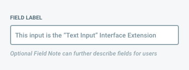
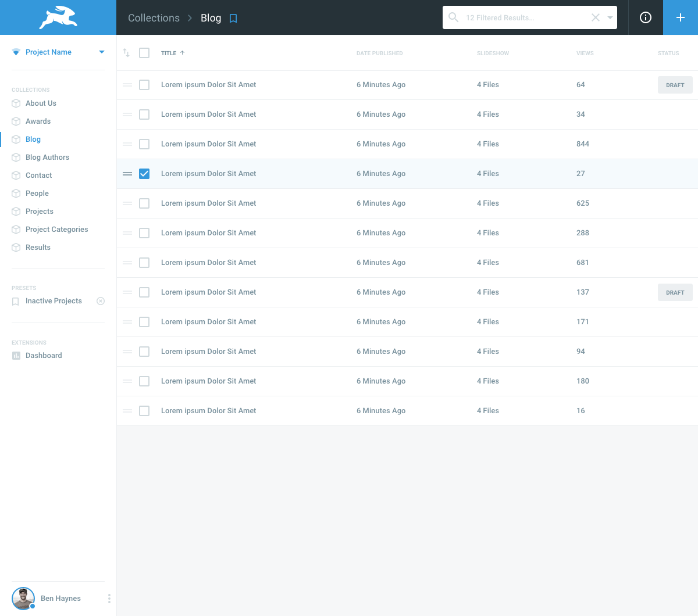

# Directus Style Guidelines

## Introduction

A lot of thought has gone into the Directus brand and UX. It is therefore extremely important to maintain consistency across the Application and all extensions. Whenever possible, this guide should be followed to the letter. If any questions arise please feel free to reach out to Ben Haynes on Directus Slack (@Interben), the Project Lead and head designer.

## Global CSS Variables

To keep things standardized across many extensions, we have a global set of CSS/SCSS variables that are available within the App. Whenever possible, these variables should be used. Variables can be found here: /src/assets/global.scss

### Variable Usage

* Colors
* Transition Speed & Easing
* Border Radius
* Box Shadow
* Interface Border Width
* Interface Widths

## Typography

All type is rendered in the Roboto typeface with four weights: light (300), regular (400), medium (500), and bold (700). General text should be rendered in the page default:

```css
font-size: 13px
font-weight: 500
line-height: 17px
color: --dark-gray (an alias of --blue-grey-600)
text-rendering: optimizeLegibility
font-smoothing: antialiased
selection: #e1f0fa
```

## Iconography

Directus uses the Material Design Icon Set, and only this set should be used unless otherwise warranted. Every attempt should be made for icons to be clear and optically aligned using Google's guide. Proper sizing for icons includes: 18px, 24px, 36px, 48px, etc

Icons used within bordered interfaces (eg: Text Input) should typically be 10px from the edges, or 20px for more padded bordered interfaces (eg: WYSIWYG)

When an icon is to be used alongside text, proper optical vertical alignment is crucial. Some icons are "visually weighted" to one side and should be adjusted from true center by 1-2 pixels to compensate. 

When an icon is to be used within a box/container, proper optical alignment is crucial. Some icons are "visually weighted" to one side (or have odd pixel dimensions at certain sizes) and should be adjusted from true center by 1-2 pixels to compensate. 

All icons should be vector and one-off icons (not in MD) should be included inline. 

::: tip
When in doubt about icon alignment, take a screenshot and use a photo application to inspect it zoomed-in. Measure the distance on sides to ensure things are aligned/centered.
:::

## Colors

Directus uses the Material Design Color Palette but the limited subset of "brand" colors should be used whenever possible. The entire Material design palette is available as global CSS variables, and aliases have been created for each brand color.

### Brand Colors

#### Grays

```css
--darkest-gray: var(--blue-grey-900);
--darker-gray: var(--blue-grey-800);
--dark-gray: var(--blue-grey-600);
--gray: var(--blue-grey-400);
--light-gray: var(--blue-grey-300);
--lighter-gray: var(--blue-grey-100);
--lightest-gray: var(--blue-grey-50);
```

#### Other Colors

```css
--body-background: #f9fafa; // Form background to provide more contrast with White
--accent: var(--light-blue-600);
--white
--black
```

#### Action Colors

```css
--action: var(--light-blue-600);
--success: var(--green);
--warning: var(--amber);
--danger: var(--red);
```

#### Accents and Alternates (Typically for Hover States)

```css
--accent-dark: var(--light-blue-800);
--action-dark: var(--light-blue-800);
--success-dark: var(--green-800);
--warning-dark: var(--amber-800);
--danger-dark: var(--red-800);
```

## Interface Sizing

To properly align inside the Directus field grid, special attention should be paid to the dimensions of each interface. Below we cover each in more detail.

## Columns

Directus allows for fields to be set in 1, 2, 3, or 4 columns. These columns appropriately collapse at smaller, responsive viewport widths. [Click here to learn more about the layout of the edit form](./edit-form-grid.md).

### Max-Width

Within its column, interfaces have a set/max width. Widths should always align with the following global variables:

```css
--width-x-small: 100px;
--width-small: 200px;
--width-normal: 400px;
--width-large: 600px;
--width-x-large: 800px;
```

### Height

Interfaces should use an intuitive default height based on the specific input. Whenever possible, height should be made into an Option so that the user may configure this to the content's needs. 

::: warning
Single-line interfaces (inputs, dropdowns, buttons, etc) should always try to be exactly 40px in total height unless otherwise warranted.
:::

### Spacing

For spacing (padding/margin) of elements and components, increments of 10, 20, 30, 40, etc, should be used. For less than 10px, optical alignment should be used in increments of: 2, 4, 6, or 8 pixels. 4px, 20px, and 40px are the ideal spacings.

### Field Labels & Field Notes

Each field's interface is displayed on the Item Detail page alongside a field label and field note. The system renders both of these so there is no need to include them in your interface styling. In fact, to maintain a proper distance between the label, interface, and note – no additional padding/margin should be applied to the top or bottom of the interface (unless warranted).



## Interface States 

### Default

This is the normal state of an interface, before it gets focus.


Background  
```css
--white
```

Outer Border  
```css
--lighter-gray
--input-border-width
--border-radius
```

Text / Values  
```css
value: --gray
placeholder: --lighter-gray
```

### Readonly & Disabled

The main difference here is that the background is transparent and there is no hover/focus state. The value should still be selectable so that it can be copied to the clipboard if needed.


Background  
```css
transparent
```

### Hover

Inherits default style, but border darkens.


Border  
```css
--light-gray
```


Cards should have a White background and use the global Box Shadow. When hovered, they should transition to the Box Shadow Accent, and should shift up 1px. Together, this will give the effect of raising/floating off the background.

Normal: `--box-shadow`
Hover: `--box-shadow-accent`

### Focus

The focus state should be an obvious but not overstated change, typically using the global Accent color. Borders should transition to the accent and text should darken. Secondary information should be initially hidden, and shown only on focus (eg: characters remaining indicator seen below). If an inline icon is used, it can also transition to the Accent color on focus (see below).


Border  
```css
--accent
```

Text  
```css
--dark-gray
```

### Validation

Each field must pass system validation to be saved, if it is invalid then the interface itself should show this. Borders should transition to Danger. Additionally, an icon (typically "X") can be shown inline. Text should remain the default focus color, but can transition to Danger upon blur. Optionally, you can create an explicit valid state to be shown while updating/typing.


Border  
```css
--danger
```

Optional: Text (Blur Only)  
```css
--danger
```

### Listing View

Interfaces are updated on the Item Detail page (see above), but a static value is also shown on the Item Listing page (see below). You must decide on the best way to present your interface's data as a useful, raw, small, snippet of data. Below are some examples:

* Title  
  Text Input Interface: Shows plaintext
* Date Published  
  Date Time Interface: Shows timestamp by default, option for "contextual time" (seen example)
* Slideshow  
  Multiple Files Interface: Since this is a relational interface that could have many attached images/files, instead we choose to show the File Count on the listing page.
* Views  
  Numeric Interface: Shows the the plain number value
* Status Interface  
  Shows as a "badge" or "placard" to help it stand out. There is also an option to only show a dot of color (no text) for a more minimal view.



::: tip
There are other Item Listing views such as Calendar, Card, Map, etc. But the Tabular (seen above) is the system default/fallback – so this is the one that must be considered first.
:::
