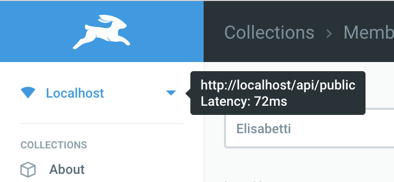
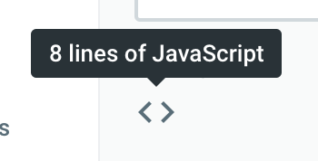

# Tooltips





Directus has the [`v-tooltip`](https://github.com/Akryum/v-tooltip) library installed and in use. This means you can add a tooltip with helpful info for the user by adding the `v-tooltip` directive to any element:

```vue
<p v-tooltip="€1">$1.17</p>
```

Please checkout the docs for [`v-tooltip`](https://github.com/Akryum/v-tooltip) for more advanced usage instructions.
